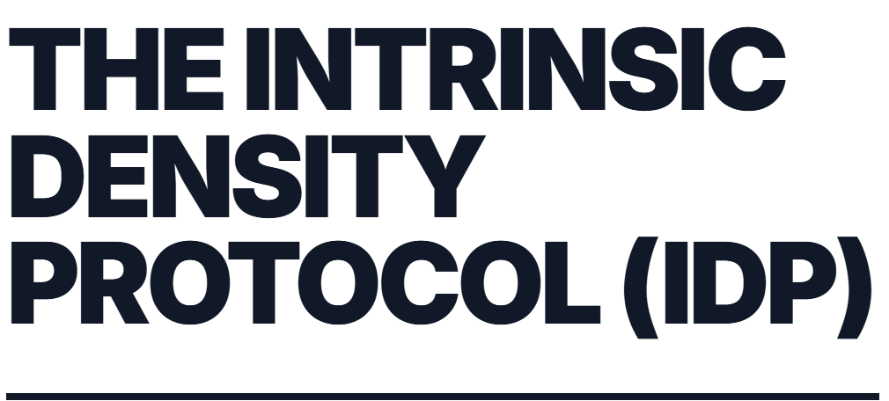

# The Intrinsic Density Protocol (IDP)

[](https://www.npmjs.com/package/idp-framework)
[](https://opensource.org/licenses/MIT)
[](https://the-intrinsic-density-protocol.vercel.app/)



> A CSS framework for high-density, container-driven layouts using golden ratio proportions.

**[📺 Live Demo](https://the-intrinsic-density-protocol.vercel.app/)** | **[📦 npm](https://www.npmjs.com/package/idp-framework)** | **[📖 GitHub](https://github.com/DiegoVallejoDev/The-Intrinsic-Density-Protocol-IDP-)**

```bash
npm install idp-framework
```

**Version:** 1.0.1 | **License:** MIT

## The Manifesto: Stop Designing for the iPhone 5

The Intrinsic Density Protocol (IDP) is a rejection of the "Web 2012" responsive design paradigm. It asserts that the standard 12-column grid and the "Mobile First" single-column stack are obsolete artifacts of an era defined by low-resolution displays (320px width) and limited bandwidth.

**We are currently designing software for ghosts.**

Modern hardware—from 6.7" Retina mobile displays (400ppi+) to 49" Ultrawide monitors—demands **Information Density**, not whitespace. IDP provides the technical and philosophical framework to reclaim wasted pixels and respect the user's cognitive bandwidth.

## The Historical Failure

### The 12-Column Stagnation

In 2011-2012, frameworks like Bootstrap and Foundation standardized the web. They solved the chaos of the early mobile web by imposing a strict rule: **On mobile, stack everything vertically.**

This was necessary when a phone screen was 3.5 inches and 320 pixels wide. It is negligence today.

### The Hardware/Software Divergence

* **Hardware (2025):** Handheld devices have higher resolution than desktop monitors from 2015. Ultrawide monitors (21:9) are standard in productivity environments.

* **Software (2025):** We still force users to scroll through 4,000 pixels of vertical height to consume data that could fit in a single 500px "Bento" grid. We still center content on ultrawide monitors, leaving 50% of the screen as dead `margin-auto` space.

IDP creates a new standard: **Density as a Service.**

## The Three Axioms

### Axiom I: The Mobile Density Paradox

**Premise:** Scrolling is cognitively expensive ("The Scroll Tax"). Scanning with peripheral vision is cheap.
**Observation:** Western design fetishizes "whitespace" and "minimalism," often at the cost of utility. Eastern design (notably Japanese mobile web) prioritizes high information density, minimizing scroll depth.
**The IDP Solution:**
We reject the single-column mobile stack. By using CSS Grid with `minmax` and `auto-fill`, IDP layouts automatically render 2 or even 3 functional columns on modern mobile devices.

> **Rule:** If a metric can be displayed above the fold without compromising legibility, hiding it below the fold is a design failure.

### Axiom II: The Component Singularity

**Premise:** Viewport Media Queries (`@media (min-width: 768px)`) are a crude instrument. They measure the *browser window*, not the *context* of the component.
**The IDP Solution:**
IDP relies exclusively on **Container Queries**. A card component should not know what device it is on; it should only know how much space it has.

* If a card has 300px: Display vertical stack.

* If a card has 500px: Display horizontal "Swimlane".

* This happens independently of whether the user is on a Tablet, Desktop, or an Ultrawide sidebar.

### Axiom III: The Ultrawide Mandate

**Premise:** The standard `container { max-width: 1200px; margin: 0 auto; }` is hostile to 21:9 displays. It isolates content in the center of the screen, far from OS controls, surrounded by "The Void."
**The IDP Solution:**
**The Cockpit Layout.**

1. **Anchor Left:** The primary reading content is anchored to the left-center (The Reading Zone).

2. **Reclaim Right:** The massive empty space on the right is converted into a **Context Panel**. This panel houses metadata, table of contents, related links, or live diagnostics. It is never empty.

## Installation & Usage

### Import the Framework

Add the IDP CSS to your project:

```html
<link rel="stylesheet" href="dist/idp-framework.min.css">
```

Or import in your CSS/JS:

```css
@import 'idp-framework/dist/idp-framework.min.css';
```

```javascript
import 'idp-framework/dist/idp-framework.min.css';
```

### Basic Layout

```html
<body class="idp-shell has-context">
    <nav class="region-nav">...</nav>
    <main class="region-main">...</main>
    <aside class="region-context">...</aside>
</body>
```

### Demo
if built with `pnpm run build-demo-website`, The `dist/index.html` file contains an interactive demo of the IDP framework. Open it in any modern browser (Chrome/Edge 105+, Safari 16+, Firefox 110+) and toggle the "Legacy Mode" button to compare IDP with traditional responsive design.

## Philosophy: Pixel Economics

**1. The Pixel is Expensive.**
A pixel on a user's screen represents attention and battery life. Do not squander it on decorative emptiness.

**2. Respect the Thumb.**
On mobile, the bottom 30% of the screen is the primary interaction zone. IDP favors placing dense navigation and control grids here, rather than hamburger menus at the top.

**3. Data-Ink Ratio.**
Borrowing from Edward Tufte: Minimize the non-data ink. Remove heavy borders, drop shadows, and decorative backgrounds. Use spacing (tight) and alignment to define hierarchy.

## Technical Implementation

IDP is agnostic to framework (React, Vue, Svelte) but strict on CSS implementation. It requires no JavaScript for layout logic.

### 1. The Bento Grid (Layout Engine)

Replace rigid column classes (`col-6`, `w-1/2`) with intrinsic grid logic.

```css
.bento-grid {
  display: grid;
  gap: 1rem;
  /* * The Magic:
   * 1. auto-fill: Fits as many columns as possible.
   * 2. minmax(180px, 1fr): Cards never shrink below 180px.
   * On a 390px iPhone 14, this mathematically forces 2 columns.
   * On a Desktop, it flows to 6.
   */
  grid-template-columns: repeat(auto-fill, minmax(180px, 1fr));
}
```

### 1.5. The Golden Ratio Philosophy

IDP uses the **golden ratio (φ ≈ 1.618)** as a comprehensive design principle throughout the entire framework. Every proportion—from micro-spacing to macro-layouts—derives from the golden ratio and Fibonacci sequence, creating a mathematically harmonious design system.

#### What is the Golden Ratio?

```
φ (phi) = 1.618033988749895
1/φ = 0.618033988749895 (≈ 61.8% - the major section)
φ² = 2.618033988749895
1/φ² = 0.381966011250105 (≈ 38.2% - the minor section)

Fibonacci sequence: 1, 1, 2, 3, 5, 8, 13, 21, 34, 55, 89, 144...
(Each number divided by the previous ≈ 1.618)
```

The golden ratio appears throughout nature (nautilus shells, sunflowers, human proportions), classical art (Mona Lisa, Parthenon), and modern design. It creates proportions that the human eye naturally finds pleasing and harmonious.

#### The Golden Design System in IDP

**1. Fibonacci Spacing Scale**

IDP uses a Fibonacci-derived spacing system instead of arbitrary linear scales:

```css
/* Fibonacci-based spacing (in pixels): 1, 2, 3, 5, 8, 13, 21, 34, 55, 89 */
--s-fib-1: 0.0625rem;   /* 1px */
--s-fib-2: 0.125rem;    /* 2px */
--s-fib-3: 0.1875rem;   /* 3px */
--s-fib-5: 0.3125rem;   /* 5px */
--s-fib-8: 0.5rem;      /* 8px */
--s-fib-13: 0.8125rem;  /* 13px */
--s-fib-21: 1.3125rem;  /* 21px */
--s-fib-34: 2.125rem;   /* 34px */
--s-fib-55: 3.4375rem;  /* 55px */
--s-fib-89: 5.5625rem;  /* 89px */

/* Semantic aliases mapped to Fibonacci values */
--s-xs: var(--s-fib-3);    /* 3px */
--s-sm: var(--s-fib-5);    /* 5px */
--s-md: var(--s-fib-8);    /* 8px */
--s-lg: var(--s-fib-13);   /* 13px */
--s-xl: var(--s-fib-21);   /* 21px */
```

**2. φ-Based Typography Scale**

The type scale follows golden ratio progression, with each size multiplying by φ or √φ:

```css
--text-xs: 0.786rem;    /* base / φ */
--text-base: 1rem;      /* 16px - the golden base */
--text-lg: 1.272rem;    /* base × φ^0.5 */
--text-xl: 1.618rem;    /* base × φ */
--text-2xl: 2.058rem;   /* base × φ^1.5 */
--text-3xl: 2.618rem;   /* base × φ² */

/* The golden line height for optimal readability */
--leading-golden: 1.618;  /* φ line height */

/* Reading widths based on golden proportions */
--reading-width-narrow: 38.2ch;   /* Minor section */
--reading-width-golden: 61.8ch;   /* Major section */
```

**3. Golden Motion System**

Animation durations follow φ progression for natural, harmonious timing:

```css
--duration-fast: 100ms;       /* Base */
--duration-normal: 162ms;     /* 100 × φ */
--duration-moderate: 262ms;   /* 100 × φ^1.5 */
--duration-slow: 424ms;       /* 100 × φ² */

/* Golden easing using φ control points */
--ease-golden: cubic-bezier(0.382, 0, 0.618, 1);  /* 1-1/φ, 0, 1/φ, 1 */
```

**4. Golden Grid Layouts**

Multiple layout patterns based on golden proportions:

```css
/* Classic 1.618:1 split */
.golden-split {
  grid-template-columns: 1.618fr 1fr;
}

/* Sidebar using minor section (38.2%) */
.golden-sidebar {
  grid-template-columns: 0.382fr 1fr;
}

/* Three columns: 1:φ:φ² */
.golden-thirds {
  grid-template-columns: 1fr 1.618fr 2.618fr;
}

/* Golden spiral with named areas */
.golden-spiral {
  grid-template-columns: 1.618fr 1fr 0.618fr;
  grid-template-rows: 1.618fr 1fr 0.618fr;
  grid-template-areas:
    "hero hero sidebar"
    "hero hero sidebar"
    "primary secondary tertiary";
}

/* Auto-fill with golden minimum */
.golden-bento {
  grid-template-columns: repeat(auto-fill, minmax(161.8px, 1fr));
}
```

**5. Golden Container Breakpoints**

Container query breakpoints scale from 320px by φ^n:

```
320px   (mobile baseline)
518px   (320 × φ - tablet)
838px   (320 × φ² - desktop)
1356px  (320 × φ³ - large desktop)
```

**6. Golden Aspect Ratios**

```css
.aspect-golden { aspect-ratio: 1.618 / 1; }           /* Classic golden rectangle */
.aspect-golden-portrait { aspect-ratio: 1 / 1.618; }  /* Vertical golden rectangle */
.aspect-golden-wide { aspect-ratio: 2.618 / 1; }      /* φ² wide */
```

**7. Golden Component Proportions**

Components use golden ratios internally:

```css
/* Card with 38.2%/61.8% header/body split */
.card--golden .card__header { flex: 0 0 38.2%; }
.card--golden .card__body { flex: 1; }  /* ≈61.8% */

/* Button padding: vertical / horizontal ≈ 1/φ */
padding: var(--s-fib-5) var(--s-fib-8);  /* 5px / 8px */
```

#### Why Use Golden Ratio Throughout?

1. **Visual Harmony**: Creates naturally pleasing proportions recognized subconsciously
2. **Systematic Coherence**: Every measurement relates mathematically to every other
3. **Scalability**: Ratios remain harmonious at any scale
4. **Reduced Decisions**: The math dictates proportions, removing arbitrary choices
5. **Nature-Inspired**: Aligns with patterns found throughout the natural world

### 2. The Intrinsic Card (Component Engine)

Components define their own reality.

```css
.card-container {
  container-type: inline-size;
}

/* Internal logic based on self-width, not screen-width */
@container (min-width: 400px) {
  .card-layout {
    display: grid;
    grid-template-columns: 2fr 1fr; /* Image Left, Data Right */
    align-items: center;
  }
}
```

### 3. Typography Physics

Text lines must never exceed `75ch` (characters) for readability. In Legacy web, this width limitation creates margins. In IDP, this width limitation creates *opportunity* for side panels.

```css
p {
  max-width: 70ch;
  /* Remaining space is yielded to the Grid Context */
}
```

### 4. Included Components

IDP includes a suite of high-density, unopinionated UI components designed for professional applications:

*   **Forms**: Density-optimized inputs, floating labels, and compact groups.
*   **Data Vis**: Tables, badges, and metric cards.
*   **Feedback**: Alerts, callouts, and toast placeholders.
*   **Navigation**: Sidebar-first principles with mobile fallbacks.

All components adhere to **Axiom II** (Container Queries) and automatically adapt to their available space.

## Golden Ratio Quick Reference

### Core Constants
```css
--phi: 1.618033988749895
--phi-inverse: 0.618033988749895
--phi-squared: 2.618033988749895
```

### Golden Percentages
- **Major section**: 61.8% (1/φ)
- **Minor section**: 38.2% (1 - 1/φ)

### Fibonacci Spacing
`1px, 2px, 3px, 5px, 8px, 13px, 21px, 34px, 55px, 89px`

### Golden Layout Classes
- `.golden-split` - 1.618:1 two-column
- `.golden-sidebar` - 38.2% sidebar
- `.golden-thirds` - 1:φ:φ² three-column
- `.golden-spiral` - 5-zone golden spiral grid
- `.golden-bento` - Auto-fill with 161.8px minimum
- `.aspect-golden` - 1.618:1 aspect ratio

### Container Breakpoints
```
320px → 518px → 838px → 1356px
(each step × φ)
```

### Typography Scale
```
xs: 0.786rem → base: 1rem → lg: 1.272rem → xl: 1.618rem → 2xl: 2.058rem → 3xl: 2.618rem
(each step × φ^0.5 or φ)
```

### Motion Timing
```
fast: 100ms → normal: 162ms → moderate: 262ms → slow: 424ms
(each step × φ)
```

## License

This project is open source under the MIT License. You are free to fork, modify, and use IDP in commercial applications. We only ask that you stop building single-column websites for high-resolution devices.